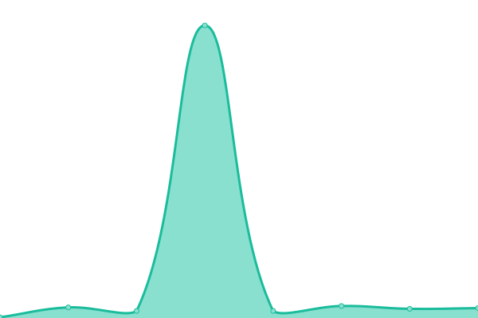

# [📈 Live Status](https://uptime.givefood.org.uk): <!--live status--> **🟩 All systems operational**

This repository contains the open-source uptime monitor and status page for [Give Food](https://www.givefood.org.uk), powered by [Upptime](https://github.com/upptime/upptime).

With [Upptime](https://upptime.js.org), you can get your own unlimited and free uptime monitor and status page, powered entirely by a GitHub repository. We use [Issues](https://github.com/givefood/upptime/issues) as incident reports, [Actions](https://github.com/givefood/upptime/actions) as uptime monitors, and [Pages](https://uptime.givefood.org.uk) for the status page.

<!--start: status pages-->
<!-- This summary is generated by Upptime (https://github.com/upptime/upptime) -->
<!-- Do not edit this manually, your changes will be overwritten -->
<!-- prettier-ignore -->
| URL | Status | History | Response Time | Uptime |
| --- | ------ | ------- | ------------- | ------ |
|  [Give Food Homepage](https://www.givefood.org.uk/) | 🟩 Up | [give-food-homepage.yml](https://github.com/givefood/upptime/commits/HEAD/history/give-food-homepage.yml) | 

 343ms
     
 | 

<a href="https://uptime.givefood.org.uk/history/give-food-homepage">100.00%</a>
    

|  [Give Food API 1 food banks dump](https://www.givefood.org.uk/api/1/foodbanks/) | 🟩 Up | [give-food-api-1-food-banks-dump.yml](https://github.com/givefood/upptime/commits/HEAD/history/give-food-api-1-food-banks-dump.yml) | 

 391ms
     
 | 

<a href="https://uptime.givefood.org.uk/history/give-food-api-1-food-banks-dump">100.00%</a>
    

|  [Give Food API 2 food banks dump](https://www.givefood.org.uk/api/2/foodbanks/) | 🟩 Up | [give-food-api-2-food-banks-dump.yml](https://github.com/givefood/upptime/commits/HEAD/history/give-food-api-2-food-banks-dump.yml) | 

 452ms
     
 | 

<a href="https://uptime.givefood.org.uk/history/give-food-api-2-food-banks-dump">100.00%</a>
    

|  [Give Food API 2 individual food bank](https://www.givefood.org.uk/api/2/foodbank/sid-valley/) | 🟩 Up | [give-food-api-2-individual-food-bank.yml](https://github.com/givefood/upptime/commits/HEAD/history/give-food-api-2-individual-food-bank.yml) | 

 137ms
     
 | 

<a href="https://uptime.givefood.org.uk/history/give-food-api-2-individual-food-bank">100.00%</a>
    

|  [Give Food API 2 locations dump](https://www.givefood.org.uk/api/2/locations/) | 🟩 Up | [give-food-api-2-locations-dump.yml](https://github.com/givefood/upptime/commits/HEAD/history/give-food-api-2-locations-dump.yml) | 

 799ms
     
 | 

<a href="https://uptime.givefood.org.uk/history/give-food-api-2-locations-dump">100.00%</a>
    

|  [Give Food API 2 location search](https://www.givefood.org.uk/api/2/locations/search/?lat_lng=51.178889,-1.826111) | 🟩 Up | [give-food-api-2-location-search.yml](https://github.com/givefood/upptime/commits/HEAD/history/give-food-api-2-location-search.yml) | 

 182ms
     
 | 

<a href="https://uptime.givefood.org.uk/history/give-food-api-2-location-search">100.00%</a>
    

|  [Give Food API 2 Needs](https://www.givefood.org.uk/api/2/needs/) | 🟩 Up | [give-food-api-2-needs.yml](https://github.com/givefood/upptime/commits/HEAD/history/give-food-api-2-needs.yml) | 

 260ms
     
 | 

<a href="https://uptime.givefood.org.uk/history/give-food-api-2-needs">100.00%</a>
    

|  [Datasette](https://datasette.givefood.org.uk/) | 🟩 Up | [datasette.yml](https://github.com/givefood/upptime/commits/HEAD/history/datasette.yml) | 

 330ms
     
 | 

<a href="https://uptime.givefood.org.uk/history/datasette">100.00%</a>
    

<!--end: status pages-->

[**Visit our status website →**](https://uptime.givefood.org.uk)

## 📄 License

- Powered by: [Upptime](https://github.com/upptime/upptime)
- Code: [MIT](./LICENSE) © [Give Food](https://www.givefood.org.uk)
- Data in the `./history` directory: [Open Database License](https://opendatacommons.org/licenses/odbl/1-0/)
